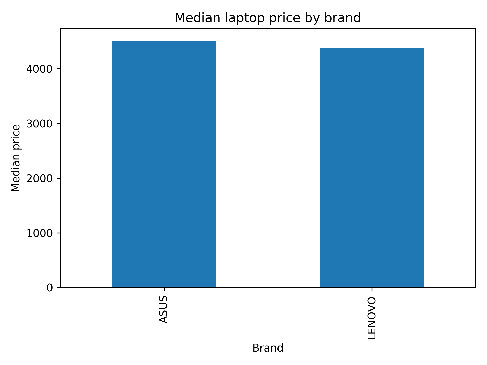
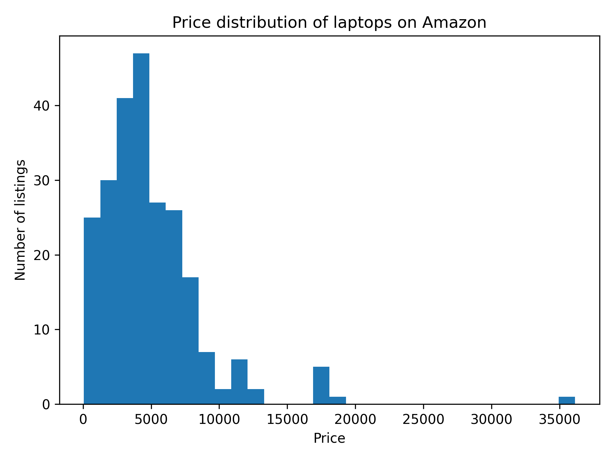

# Amazon Laptop Pricing Analysis

## Overview
This project analyzes laptop listings on Amazon to understand how brand and consumer signals influence product pricing. Using real-world scraped data, the analysis focuses on identifying pricing patterns driven by brand positioning, customer ratings, review volume, and satisfaction indicators.

The goal is to translate raw marketplace data into insights that support pricing and product positioning decisions.

---

## Business Question
Which brand and customer-related factors are most strongly associated with laptop prices on Amazon, and how do these factors shape price segmentation across the market?

---

## Data
- Source: Public Amazon product listings
- Collection method: Web scraping using Octoparse
- Scope: Laptop listings across multiple brands
- Key variables:
  - `brand`
  - `price`
  - `rating`
  - `review_count`
  - `satisfied`

The dataset was cleaned and prepared using SAS before being analyzed in Python.
Data reflects listings at the time of collection and may not represent current prices.

---

## Methodology
1. Data cleaning and validation (SAS)
2. Exploratory data analysis in Python
3. Price distribution and segmentation analysis
4. Brand-level median price comparison
5. Relationship analysis between price, ratings, and review volume

---

## Key Insights
- Laptop prices show a right-skewed distribution, with most products concentrated in the mid-range and a smaller premium segment.
- Brand plays a significant role in price differentiation, with clear separation between premium and budget brands.
- Customer ratings alone do not strongly explain price differences across listings.
- Review volume shows a weak and noisy relationship with price, suggesting social proof does not directly translate to premium pricing.
- Satisfaction indicators show limited impact on pricing, reinforcing the importance of brand positioning over consumer feedback metrics.

---

## Limitations
- Prices reflect listed prices at the time of scraping, not completed transactions.
- Product specifications (e.g., RAM, processor, storage) were not included and may explain additional price variation.
- Promotional discounts and stock availability were not captured.

---
## Key Insights
- Laptop prices are heavily right-skewed, with most listings concentrated in the lower to mid-price range and a small premium segment.
- Brand contributes to price positioning, with comparable median pricing observed among brands with sufficient listings.
- Customer ratings do not show a strong relationship with price, indicating that higher ratings do not guarantee premium pricing.
- Review volume exhibits a weak and inconsistent relationship with price, suggesting that popularity does not directly translate into higher prices.
- Satisfaction indicators show limited differentiation in pricing levels.

### Pricing patterns by brand


### Overall price distribution



## Project Structure

```text
amazon-laptop-pricing-analysis/
├── data/
│   └── cleaned/
│       └── amazon_laptops_cleaned_public.csv
├── notebooks/
│   ├── 00_data_preparation.ipynb
│   └── 01_pricing_eda.ipynb
├── visuals/
│   ├── price_distribution.png
│   └── median_price_by_brand.png
└── README.md
```

